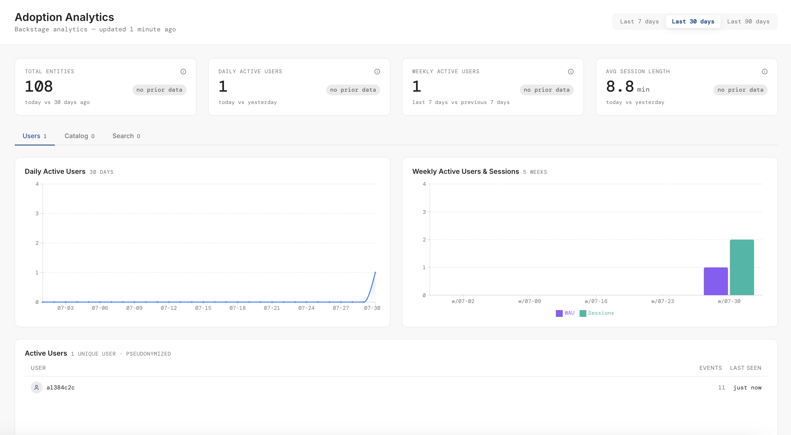

# @codeverse-gp/plugin-adoption-analytics

Backstage Portal analytics dashboard, plus the analytics API that feeds it.

- Backend: [`@codeverse-gp/plugin-adoption-analytics-backend`](../adoption-analytics-backend/README.md)
- Shared types and permissions: [`@codeverse-gp/plugin-adoption-analytics-common`](../adoption-analytics-common/README.md)

This package does two separate jobs: it **captures** analytics events from every
page of the portal, and it **renders** the dashboard at `/adoption-analytics`. The two can
be installed independently — capture works without anyone ever opening the page.

## What it provides

### Dashboard (`/adoption-analytics`)

A KPI row plus three tabbed sections, with a 7 / 30 / 90-day range selector.

| KPI                 | Comparison                     | Follows range selector |
| ------------------- | ------------------------------ | ---------------------- |
| Total entities      | today vs N days ago            | Yes                    |
| Daily active users  | today vs yesterday             | No                     |
| Weekly active users | last 7 days vs previous 7 days | No                     |
| Avg. session length | today vs yesterday             | No                     |

Only Total Entities follows the range selector; the other three always describe
"right now". Each card's sub-label states its baseline.

| Tab       | Contents                                                              |
| --------- | --------------------------------------------------------------------- |
| `users`   | DAU chart (new vs. returning), WAU + sessions chart, active-user list |
| `catalog` | Entity growth over time, top-viewed entities, top visited pages       |
| `search`  | Search volume over time, most-searched terms                          |
| `plugins` | Per-plugin events, distinct users, share of activity and trend        |

Plugin adoption only counts events that carry an analytics `pluginId`, so a
plugin that never sets an analytics context won't appear even if its routes
show up under top visited pages.

The active-user list shows pseudonyms such as `user:masked/1a2b3c4d` unless the
caller holds `adoption-analytics.users.read`. Pseudonyms are stable for a given salt, so
you can follow one user's behaviour without learning who they are.



### Analytics capture

`AdoptionAnalyticsCaptureApi` implements Backstage's `AnalyticsApi` and forwards events
to the backend. It captures `sign-in`, `navigate`, `click` and `search`.

- **Batching** — flushes every 5s or every 20 events, whichever comes first.
- **Search debounce** — 800ms, and queries shorter than 2 characters are dropped,
  so a search box does not emit one event per keystroke.
- **Sessions** — a per-tab id in `sessionStorage`, expiring after 30 minutes idle
  or at a calendar day change. This is what makes average session length possible.
- **Unload** — the final flush uses `keepalive` so events are not lost when the
  tab closes.
- **Failure** — batches never throw. A failed flush is logged and dropped rather
  than surfacing an error to the user; analytics must never break a page.

`CompositeAnalyticsApi` fans one event out to several `AnalyticsApi`
implementations, so Adoption Analytics can run alongside an existing provider such as GA4
rather than replacing it.

## Install

Install this plugin:

```bash
# From your Backstage root directory
yarn --cwd packages/app add @codeverse-gp/plugin-adoption-analytics
```

**Dashboard** — Wire up the API implementation to your App:

```ts
// packages/app/src/App.tsx
import adoptionAnalyticsPlugin from '@codeverse-gp/plugin-adoption-analytics';

export const app = createApp({
  features: [adoptionAnalyticsPlugin /* ... */],
});
```

This registers the page at `/adoption-analytics`, a sidebar nav item, and the
`adoptionAnalyticsApiRef` client.

**Capture** — register the analytics API:

```ts
// packages/app/src/apis.ts
import {
  analyticsApiRef,
  discoveryApiRef,
  errorApiRef,
  fetchApiRef,
} from '@backstage/core-plugin-api';
import { ApiBlueprint } from '@backstage/frontend-plugin-api';
import {
  AdoptionAnalyticsCaptureApi,
  AdoptionAnalyticsClient,
} from '@codeverse-gp/plugin-adoption-analytics';

const analyticsApi = ApiBlueprint.make({
  name: 'analyticsApi',
  params: defineParams =>
    defineParams({
      api: analyticsApiRef,
      deps: {
        discoveryApi: discoveryApiRef,
        fetchApi: fetchApiRef,
        errorApi: errorApiRef,
      },
      factory: ({ discoveryApi, fetchApi, errorApi }) =>
        new AdoptionAnalyticsCaptureApi({
          adoptionAnalyticsApi: new AdoptionAnalyticsClient({
            discoveryApi,
            fetchApi,
          }),
          onError: (error: unknown) =>
            errorApi.post(
              error instanceof Error ? error : new Error(String(error)),
              { hidden: true },
            ),
        }),
    }),
});
```

Already have an analytics provider? Wrap both in `CompositeAnalyticsApi` instead
of replacing the existing factory — see [Exports](#exports).

The backend plugin must be installed for either part to do anything.

## Permissions

The page checks `adoption-analytics.page.view` via `usePermission` before it fetches
anything, and renders an explanatory panel instead of a failed request when the
caller is denied. The backend enforces the same permission independently, so the
frontend check is a UX affordance and not the security boundary.

**With `adoptionAnalytics.viewerGroups` unset the dashboard is open to every
signed-in user**, and user refs stay pseudonymised until
`adoptionAnalytics.identityGroups` is configured. See the
[backend README](../adoption-analytics-backend/README.md#permissions)
for the full model and the config to restrict access.

> Known limitation: the sidebar nav item is visible to everyone regardless of
> permission. Nav items are derived from the `title` and `icon` params of
> `PageBlueprint`, which emit plain data rather than a React component, so there
> is no render pass in which to run a permission hook. Denied users see the
> entry and get the access panel on click.

## Exports

| Export                        | Purpose                                                    |
| ----------------------------- | ---------------------------------------------------------- |
| `adoptionAnalyticsPlugin`     | Default export; the frontend plugin                        |
| `AdoptionAnalyticsPage`       | The dashboard component                                    |
| `AdoptionAnalyticsClient`     | Typed client for the backend API                           |
| `adoptionAnalyticsApiRef`     | API ref for the client                                     |
| `AdoptionAnalyticsCaptureApi` | `AnalyticsApi` implementation that forwards to the backend |
| `CompositeAnalyticsApi`       | Fans one event out to several `AnalyticsApi`s              |

## Local development

```bash
yarn workspace @codeverse-gp/plugin-adoption-analytics lint
yarn tsc
```

Dashboard responses are cached for 5 minutes per range. After changing backend
config, restart the backend and switch range to force a fresh payload.
